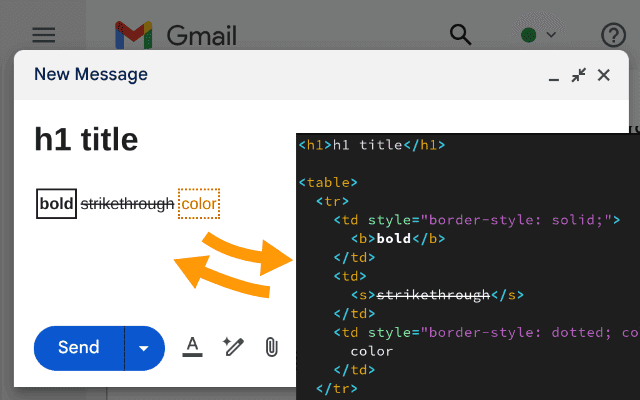

Editable HTML to clipboard
==========================

Copy or paste source HTML of editable fields to/from clipboard.

*Editable HTML to clipboard* is a Chrome browser extension that lets you copy
the HTML contents of rich text fields to the clipboard, so you can edit them
with your favorite code editor, then paste them back into the rich text input.

This is particularly useful when writing email, e.g. in Gmail, Yahoo Mail,
Outlook…

The *copy HTML source to clipboard* and *paste HTML source from clipboard*
options are available through a context menu (right click) and via keyboard
shortcuts (``Ctrl+.`` and ``Ctrl+Shift+.``). These work only on rich text fields
and plain text multiline inputs (``<textarea>`` HTML elements).

Install the browser extension from its `Chrome Web Store page <TODO>`_ (TODO).

I created this extension in replacement for the one I was using previously:
`Text-Aid-Too`_. It's not supported anymore by the Chrome Web Store, and its
implementation and installation was more complex.

.. _Text-Aid-Too: https://chromewebstore.google.com/detail/text-aid-too/klbcooigafjpbiahdjccmajnaehomajc
